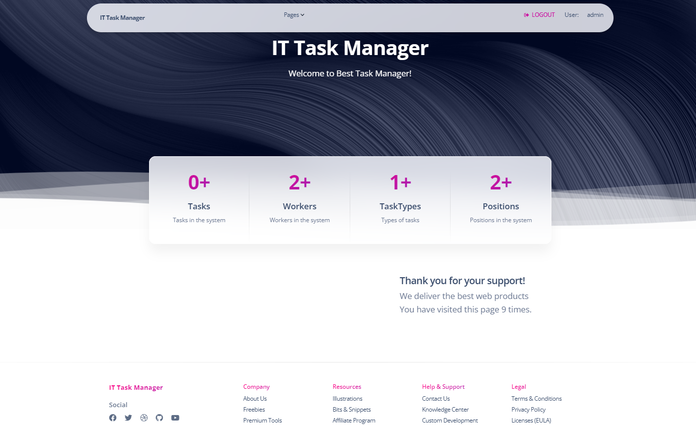

# IT Company Task Manager

## Description

This project is a task management system for an IT company that has a team of developers, designers, project managers and quality testers. My team has many IT-related tasks. I decided to implement my own task manager, which will solve all possible problems during product development in a team. Each of the team can create tasks, assign them to team members and mark the tasks as completed (preferably before the deadline, of course).

## Installation

1. $ git clone https://github.com/mtiunov/it-company-task-manager/tree/develop
2. cd it-company-task-manager
3. python3 -m venv venv
4. source venv/bin/activate
5. pip install -r requirements.txt
6. python manage.py runserver #starts Django Server

## Using

To use the task management system, follow the link [here](https://task-manager-f5qd.onrender.com).

## You can use the test user to view the functionality

- Login: user
- Password: user12345

## Appurtenances

- Django 3.0
- Python 3.8

## Contribution

If you want to help in the development of the project, please create a request pool.

## Demo

## Author

- Tiunov Mykhailo ([@mtiunov](https://github.com/mtiunov/it-company-task-manager/tree/develop))